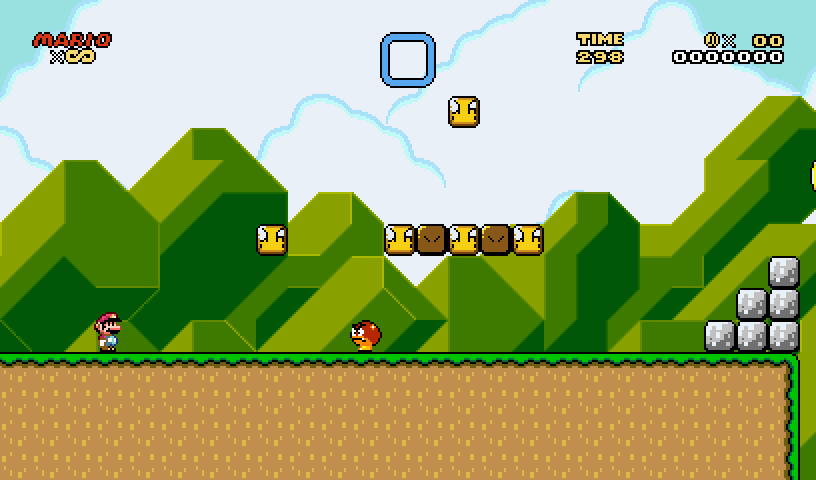
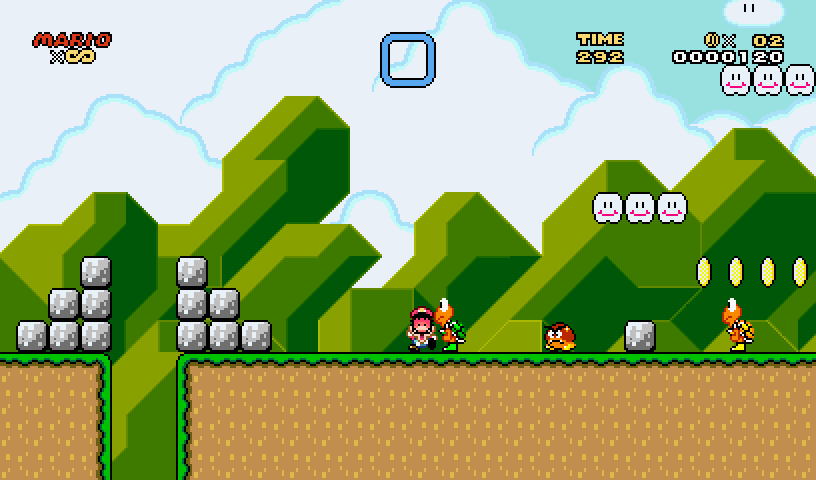
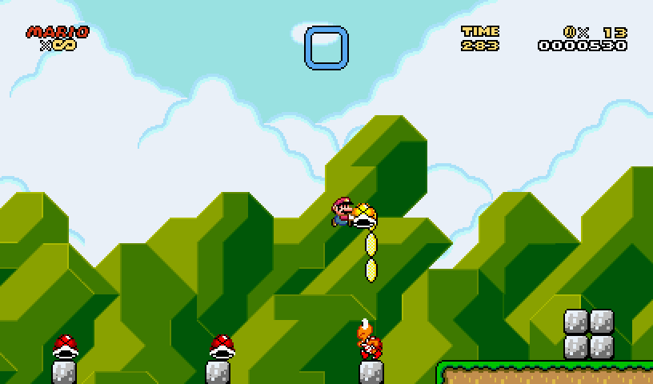
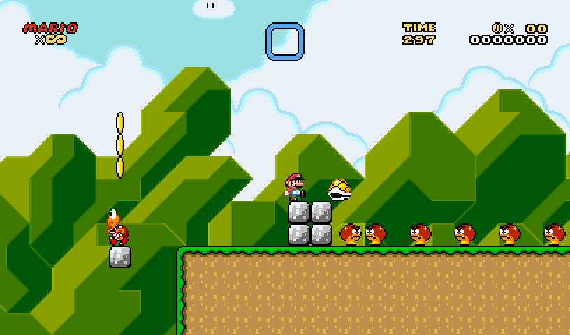
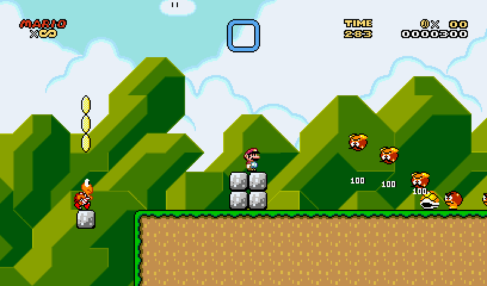
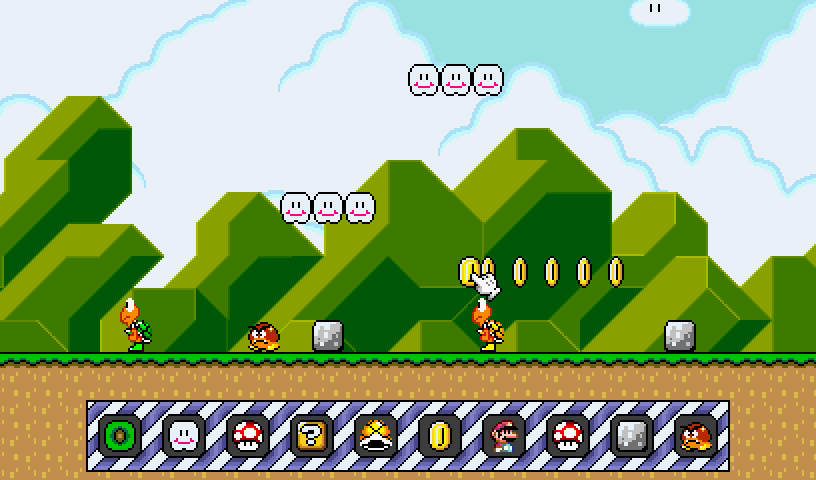
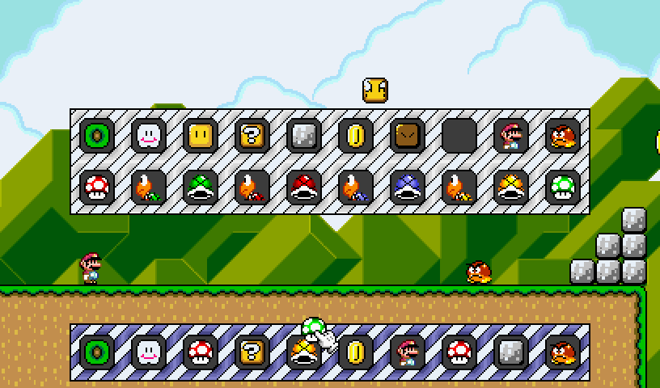

# platformer-gdi-vb
Simples jogo de 2020 com os gráficos do Super Mario World usando como renderização apenas GDI

### Controles
Setas: Mover  
Z: Correr  
X: Pular

*quando no editor:*  
E: Abrir inventário  
F: Esconder/Mostrar Paleta  
Clique Esquerdo -> Colocar  
Clique Direito -> Apagar  
Espaço: Jogar/Editar

### Screenshots

